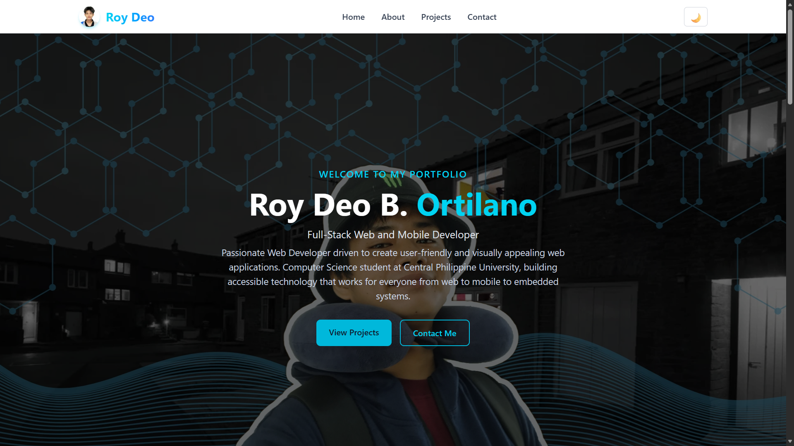

# Roy Ortilano – Personal Portfolio

A modern, responsive portfolio website built with **Next.js 14**, **TypeScript**, and **Tailwind CSS**.
Features light/dark mode, fade-in animations, a contact form via EmailJS, and full responsiveness.

## 🚀 Live Demo

[Live Demo](ortilano-my-portfolio-cspe2300.vercel.app)
ortilano-my-portfolio-cspe2300.vercel.app

---

## 📸 Screenshot



---

## ✨ Features

- Light / Dark mode toggle with localStorage persistence
- Responsive design (mobile, tablet, desktop)
- Sticky header with mobile hamburger menu
- Hero section with background image
- About section with skills and education
- Projects section with skeleton loading
- Contact form with validation and EmailJS integration
- Optimised fonts (Roboto via `next/font`, Helvetica/Arial fallback)
- Fade-in animations on scroll using Intersection Observer
- Accessible semantic HTML

---

## 🛠️ Tech Stack

| Category     | Technology              |
|--------------|-------------------------|
| Framework    | Next.js 14 (App Router) |
| Language     | TypeScript              |
| Styling      | Tailwind CSS            |
| Form Handling| EmailJS                 |
| Font         | Roboto (self-hosted)    |
| Deployment   | Vercel                  |

---

## 📁 Project Structure

```
src/
├── app/
│   ├── globals.css
│   ├── layout.tsx
│   └── page.tsx
├── components/
│   ├── layout/       (Header, Footer, Navigation)
│   ├── ui/           (Button, Card, Skeleton)
│   ├── sections/     (Hero, About, Projects, Contact)
│   ├── ThemeProvider.tsx
│   └── FadeIn.tsx
├── lib/
│   └── types.ts
public/               (images placed here)
```

---

## 🚀 Getting Started

### Prerequisites

- Node.js v18+
- npm or yarn
- Git

### Installation

1. **Clone the repository**

   ```bash
   git clone https://github.com/your-username/your-repo.git
   cd your-repo
   ```

2. **Install dependencies**

   ```bash
   npm install
   # or
   yarn
   ```

3. **Add your images**

   - Hero background → `public/images/homepage/roydeo_herobkg.webp`
   - Profile photo → `public/personal/rdprof.webp`

4. **Setup EmailJS**

   Create an account at [EmailJS](https://www.emailjs.com) and replace the keys in `src/components/sections/Contact.tsx`:

   ```ts
   const SERVICE_ID  = "your_service_id";
   const TEMPLATE_ID = "your_template_id";
   const PUBLIC_KEY  = "your_public_key";
   ```

5. **Run the development server**

   ```bash
   npm run dev
   ```

   Open [http://localhost:3000](http://localhost:3000).

---

## 📦 Production Build

```bash
npm run build
npm start
```

---

## 🌐 Deploy on Vercel

1. Push your code to GitHub.
2. Import the repository on [vercel.com](https://vercel.com).
3. Vercel will auto-detect Next.js — click **Deploy**.
4. Your site will be live at `https://your-project.vercel.app`.